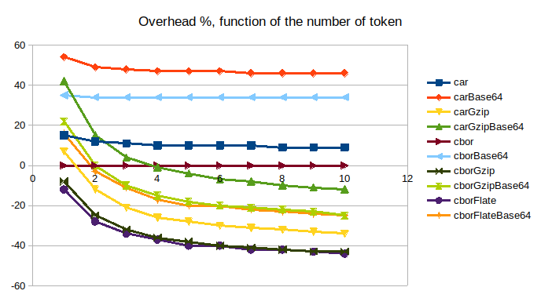
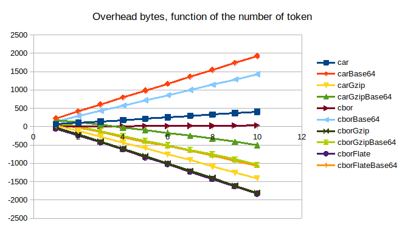
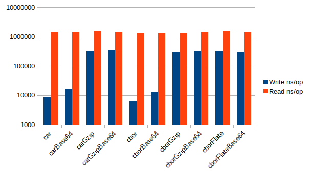
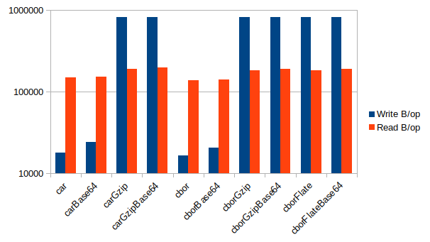
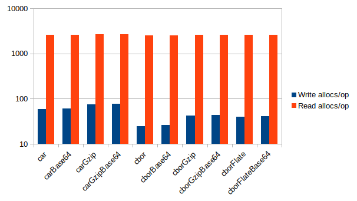

# Token container

## Why do I need that?

Some common situation asks to package multiple tokens together:
- calling a service requires sending an invocation, alongside the matching delegations
- sending a series of revocations
- \<insert your application specific scenario here>

The UCAN specification defines how a single token is serialized (envelope with signature, IPLD encoded as Dag-cbor), but it's entirely left open how to package multiple tokens together. To be clear, this is a correct thing to do for a specification, as different ways equally valid to solve that problem exists and can coexist. Any wire format holding a list of bytes would do (cbor, json, csv ...).

**go-ucan** however, provide an opinionated implementation, which may or may not work in your situation. 

Some experiment has been done over which format is appropriate, and two have been selected:
- **DAG-CBOR** of a list of bytes, as a low overhead option
- **CAR** file, as a somewhat common ways to cary arbitrary blocks of data

Notably, **compression is not included**, even though it does work reasonably well. This is because your transport medium might already do it, or should.

## Wire format consideration

Several possible formats have been explored:
- CAR files (binary or base64)
- DAG-CBOR (binary or base64)

Additionally, gzip and deflate compression has been experimented with.

Below are the results in terms of storage used, as percentage and byte overhead over the raw tokens:

| Token count | car | carBase64 | carGzip | carGzipBase64 | cbor | cborBase64 | cborGzip | cborGzipBase64 | cborFlate | cborFlateBase64 |
|-------------|-----|-----------|---------|---------------|------|------------|----------|----------------|-----------|-----------------|
| 1           | 15  | 54        | 7       | 42            | 0    | 35         | \-8      | 22             | \-12      | 16              |
| 2           | 12  | 49        | \-12    | 15            | 0    | 34         | \-25     | 0              | \-28      | \-3             |
| 3           | 11  | 48        | \-21    | 4             | 0    | 34         | \-32     | \-10           | \-34      | \-11            |
| 4           | 10  | 47        | \-26    | \-1           | 0    | 34         | \-36     | \-15           | \-37      | \-17            |
| 5           | 10  | 47        | \-28    | \-4           | 0    | 34         | \-38     | \-18           | \-40      | \-20            |
| 6           | 10  | 47        | \-30    | \-7           | 0    | 34         | \-40     | \-20           | \-40      | \-20            |
| 7           | 10  | 46        | \-31    | \-8           | 0    | 34         | \-41     | \-21           | \-42      | \-22            |
| 8           | 9   | 46        | \-32    | \-10          | 0    | 34         | \-42     | \-22           | \-42      | \-23            |
| 9           | 9   | 46        | \-33    | \-11          | 0    | 34         | \-43     | \-23           | \-43      | \-24            |
| 10          | 9   | 46        | \-34    | \-12          | 0    | 34         | \-43     | \-25           | \-44      | \-25            |

| Token count | car | carBase64 | carGzip | carGzipBase64 | cbor | cborBase64 | cborGzip | cborGzipBase64 | cborFlate | cborFlateBase64 |
|-------------|-----|-----------|---------|---------------|------|------------|----------|----------------|-----------|-----------------|
| 1           | 64  | 226       | 29      | 178           | 4    | 146        | \-35     | 94             | \-52      | 70              |
| 2           | 102 | 412       | \-107   | 128           | 7    | 288        | \-211    | 0              | \-234     | \-32            |
| 3           | 140 | 602       | \-270   | 58            | 10   | 430        | \-405    | \-126          | \-429     | \-146           |
| 4           | 178 | 792       | \-432   | \-28          | 13   | 572        | \-602    | \-252          | \-617     | \-288           |
| 5           | 216 | 978       | \-582   | \-94          | 16   | 714        | \-805    | \-386          | \-839     | \-418           |
| 6           | 254 | 1168      | \-759   | \-176         | 19   | 856        | \-1001   | \-508          | \-1018    | \-520           |
| 7           | 292 | 1358      | \-908   | \-246         | 22   | 998        | \-1204   | \-634          | \-1229    | \-650           |
| 8           | 330 | 1544      | \-1085  | \-332         | 25   | 1140       | \-1398   | \-756          | \-1423    | \-792           |
| 9           | 368 | 1734      | \-1257  | \-414         | 28   | 1282       | \-1614   | \-894          | \-1625    | \-930           |
| 10          | 406 | 1924      | \-1408  | \-508         | 31   | 1424       | \-1804   | \-1040         | \-1826    | \-1060          |

Following is the performance aspect, with CPU usage and memory allocation:

|                 | Write ns/op | Read ns/op | Write B/op | Read B/op | Write allocs/op | Read allocs/op |
|-----------------|-------------|------------|------------|-----------|-----------------|----------------|
| car             | 8451        | 1474630    | 17928      | 149437    | 59              | 2631           |
| carBase64       | 16750       | 1437678    | 24232      | 151502    | 61              | 2633           |
| carGzip         | 320253      | 1581412    | 823887     | 192272    | 76              | 2665           |
| carGzipBase64   | 343305      | 1486269    | 828782     | 198543    | 77              | 2669           |
| cbor            | 6419        | 1301554    | 16368      | 138891    | 25              | 2534           |
| cborBase64      | 12860       | 1386728    | 20720      | 140962    | 26              | 2536           |
| cborGzip        | 310106      | 1379146    | 822742     | 182003    | 42              | 2585           |
| cborGzipBase64  | 317001      | 1462548    | 827640     | 189283    | 43              | 2594           |
| cborFlate       | 327112      | 1555007    | 822473     | 181537    | 40              | 2591           |
| cborFlateBase64 | 311276      | 1456562    | 826042     | 188665    | 41              | 2596           |

(BEWARE: logarithmic scale)

Conclusion:
- CAR files are heavy for this usage, notably because they carry the CIDs of the tokens
- compression works quite well and warrants its usage even with a single token
- DAG-CBOR outperform CAR files everywhere, and comes with a tiny ~3 bytes per token overhead.

**Formats beside DAG-CBOR and CAR, with or without base64, have been removed. They are in the git history though.**