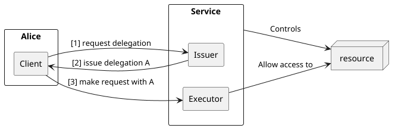
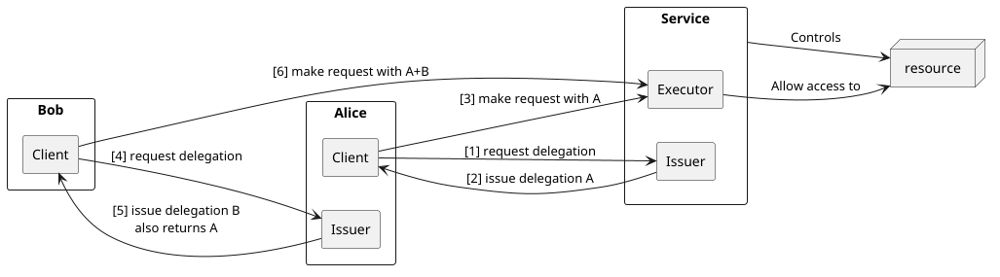

## UCAN examples

This directory contains an example of UCAN usage across multiple agents, and their respective implementations.

Please note that UCAN in itself doesn't enforce any protocol, topology or transport, and as such what you have here is one possibility among many others. In particular:
- this example is really geared towards using UCAN for an HTTP API
- it uses a particular flavor of issuer protocol and token exchange. In particular, that issuer gives delegation tokens to anyone asking.

Your situation may be different from this, and would call for a different setup.

Remember that everything in `go-ucan-toolkit` is essentially helpers, pre-made building blocks. You can use them, change them or make your own.

## Scenario 1

Starting simple, if we run `service`, `service-issuer` and `alice-client-server`, we have the following scenario:

- `service` controls the access to the resource (it's the `Executor` in that diagram). You can think about it as a proxy with authentication.
- `service-issuer` gives a delegation tokens to clients. `service` and `service-issuer` share the same DID and keypair.
- `alice-client-server` ask for a token, and periodically makes request

## Scenario 2

Building on the previous scenario, we are adding sub-delegation.

- `alice-client-server` still do the same thing, but also expose a similar token issuer with the same protocol (for simplicity in that example)
- `bob-client` request a delegation from Alice, and make **direct** request to the service

Note a few things:
- Alice can finely tune what Bob can do
- Bob receives **two** delegations: the original one Alice got and a second one delegating some of that original power to him
- Bob can make direct calls to the service without having to be proxied somewhere
- The service doesn't have to know beforehand about Bob or what power is given to him
